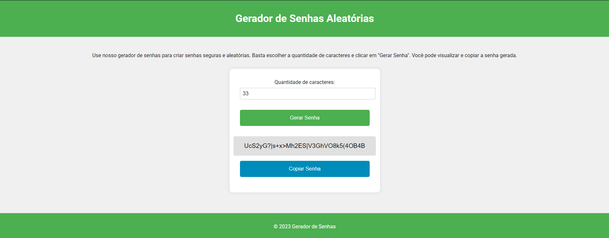

# Gerador de Senhas Aleatórias

Este é um projeto simples de um gerador de senhas aleatórias desenvolvido com HTML, CSS e JavaScript. O gerador permite que o usuário escolha a quantidade de caracteres da senha e a gere com um clique. A senha gerada pode ser copiada para a área de transferência.

### Layout do Projeto

## Funcionalidades

- Escolha a quantidade de caracteres da senha (entre 1 e 100).
- Gere uma senha aleatória com os caracteres escolhidos.
- Copie a senha gerada para a área de transferência.

## Tecnologias Utilizadas

- HTML
- CSS
- JavaScript
- [Font Awesome](https://cdnjs.cloudflare.com/ajax/libs/font-awesome/6.0.0-beta3/css/all.min.css) para ícones
- [Google Fonts](https://fonts.googleapis.com/css2?family=Roboto:wght@400;500;700&display=swap) para fontes

## Como Usar

1. Clone este repositório:
    ```bash
    git clone https://github.com/dev-medeiros/estudos_gerador_senhas.git
    ```

2. Navegue até o diretório do projeto:
    ```bash
    cd gerador-de-senhas
    ```

3. Abra o arquivo [index.html](http://_vscodecontentref_/0) no seu navegador preferido.

## Estrutura do Projeto
```
gerador-de-senhas
├── src
│   ├── index.html       # Main HTML document
│   ├── styles
│   │   └── style.css    # Styles for the webpage
│   └── scripts
│       └── main.js      # JavaScript code for interactivity
└── README.md            # Project documentation
```

## Contribuindo
Sinta-se à vontade para enviar problemas ou pull requests para melhorias ou correções de bugs.

## Licença
Este projeto é de código aberto e está disponível sob a licença MIT.
